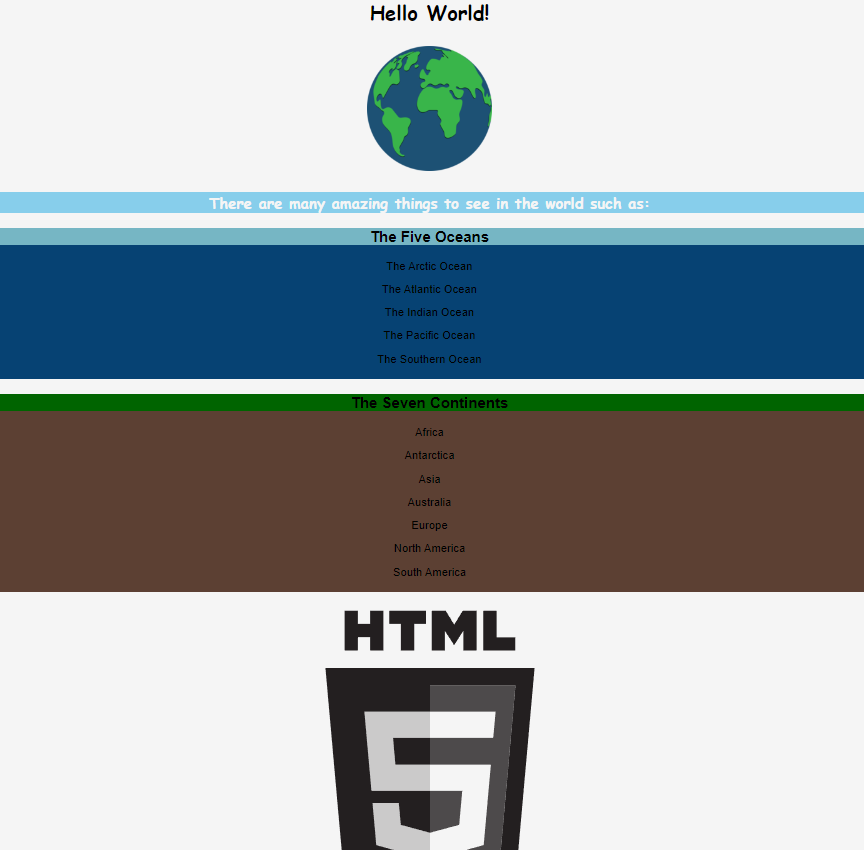
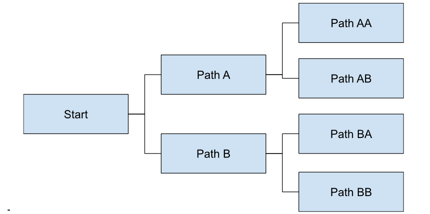

# Assignment 1

## Assignment Insight
Assignment #1 could potentially be homework or classwork, but I envisioned it as being classwork, especially since that presents the opportunity to go over it as a class later. For Assignment #1, students will be given a simple website that has 7 errors in it. Students will be tasked with finding and fixing the errors on the webpage along with explaining what the error was and how they fixed it as HTML comments. These errors are all based around an understanding of the syntax of HTML tags as well as an understanding of how HTML tags should be organized on a webpage (i.e. a title tag should be inside a head tag). 

## Student Facing Directions
You will be provided a simple webpage with 7 errors in its HTML code (so no need to check the other files unless you’re just curious). You are to find and fix as many errors as you can in 10 minutes. After you find and fix an error in the HTML, use a comment tag (detailed here https://www.w3schools.com/tags/tag_comment.asp) to explain what the error you fixed was and what you did to fix it. When you are done the webpage should look like the image below (although may differ somewhat depending on screen size), but do note that there are some errors in the file that are not related to the webpage’s appearance.

# Assignment #2

## Assignment Insight
Assignment #2 is meant to be a project larger in scope than just a homework assignment. The project is supposed to be a Choose Your Own Adventure-style project. It need not be an actual narrative story, but the important part is that the website has branching paths such that it’s not possible to go directly from any page in the site to any other page in the site. I thought this might be a good project for a theoretical HTML/CSS (probably the 1st unit in a web development course) for a few reasons. One is that it’ll help students get used to working with multiple pages and files than what may be used for shorter assignments in this unit (although I recently discovered there’s another way to do this, that I’ll talk more about later). Another reason is that this project gives students an opportunity to tailor it to their interests. But one of the biggest reasons I thought this might be a good project idea is that I thought it would lend itself nicely into the next unit for javascript when students can see another way they might go about this project and their CYOAs can be likened to conditionals.

I envisioned this project initially as being a multipage one, kinda like a website of their own making but when I was looking up projects similar to this to see if I could get any inspiration for requirements I came across this link https://codepen.io/learn43/pen/pgYKwQ and realized it was possible to make a single-page CYOA using only HTML/CSS. This could potentially be another direction to take the project in and would lead into Javascript much more naturally. I’m starting to like this approach more the more I think about it, but I’m going to write my directions the way I originally envisioned.

It won’t be in the student facing directions but if I was doing this I would also definitely be providing examples of what this project might look like.

## Student Facing Directions

For this project you all will be making websites for your own Choose Your Own Adventures, non-linear stories where users can make a choice at certain points that cause the direction of the story to change. You may feel free to make your website about whatever you want (as long as it’s appropriate for school) but it must meet the following requirements:
Your story should have the user make a choice between at least two different options. They should then make another choice between at least two different options.
This means that the bare minimum for this assignment needs 7 html files and should have a structure something like the one below, but you are more than welcome to go beyond the minimum
You should also make a .css file that is shared between all the HTML files
Each page should be more than just black text on white background. Each page should include at least one img tag and one div tag, which should be styled using css. You should also style the text as well.

