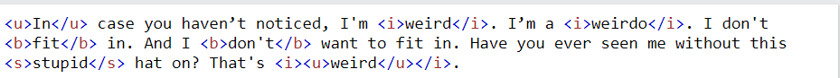
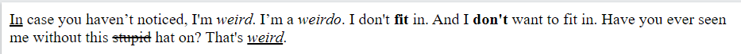

## Lesson Structure

### Standards
- 9-12.IC.6
- 9-12.IC.7

### Aim:  How Do We Write HTML code?

### Warm-Up (2-3 minutes)
Do Now: Compare these two screenshots of nearly identical text. How do these two screenshots of text differ? What connection exists between the two screenshots of text?

Students will be given 2-3 minutes to review the screenshots and think of their answers before reviewing it as a class

### Warm-Up Review (3 - 5 minutes)
After students are given some time to think of their answers to the Do Now, we'll turn this into a classwide discussion, taking time to hear students' answers to the first question of the Do Now, then the second. If no student mentions it in their answer, ask if they can tell what each tag does/corresponds to. This will act a seque into the slides and lesson for today

### Slide Presentation (15-20 minutes)
Present the slides provided in the materials

The slides for this lesson will cover
- A brief comparison of HTML vs Programming Languages
- Syntax of HTML tags
- How to properly nest HTML tags
- The 4 main HTML tags that make up an HTML document (html, head, title, body) as well as DOCTYPE HTML
- A few basic HTML tags for text (h1-h6 tags and the p tag)

In addition, a quick live coding demonstration using Inspect Element to better show what the title tag affects

### Exit Ticket / Homework (Rest of Class)
After presenting the slides, students will spend the rest of class creating a basic personal web page from scratch. The GitHub Classroom starter code will have the file already created for them but will be otherwise empty. For this assignment students will need to
1. Inclue and properly order the 4 basic structure tags of HTML +  DOCTYPE HTML
2. Use one of the heading tags to write their name (or pseudonym if they prefer) inside the body
3. Write another, smaller heading tag that says "About Me" (or another appropriate sub-heading if they prefer) inside the body
4. Use the p tag to write a bit about themselves inside the body
5. Commit/Push when they are finished and if they wish, publish it using GitHub Pages
6. Submit a link to the webpage when they're done on Google Classroom 
In addition to these instructions being on Google Classroom where they will find the link to the assignment, these instructions will also be in the readme.md with the student's starter code. Anything students do not finish in class will be expected to be done for homework.
