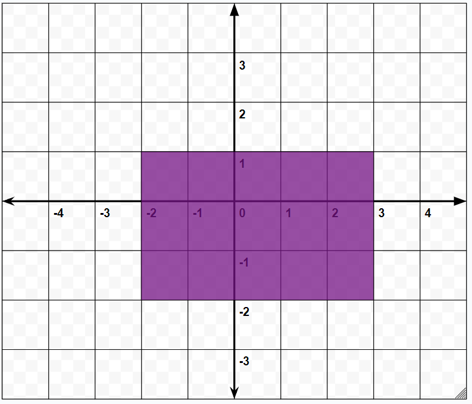

## Lesson Structure

### Standards
- 9-12.IC.7
- 9-12.DL.5

### Aim:  How Can We Use CSS to Resize and Position HTML Elements?

### Warm-Up (2-3 minutes)
Do Now: What are the coordinates of each corner of the rectangle in the image? 

Students will be given 2-3 minutes to write down their answers.

### Warm-Up Review (3-5 minutes)
After students are given some time to do the Do Now, the teacher will call on students to share their answers, which will be used to segue into the lessons and the slides.

### Slide Presentation (20-25 minutes)
Present the slides provided in the materials

The slides for this lesson will cover
- Coordinates in Math vs Coordinates in Computer Programs
- top,left,bottom,right CSS properties
- position CSS property
- position: static
- position: relative
- position: absolute
- position: fixed
- width, height CSS property 
- background-image CSS property
- example/explanation of what students will be working on next

In addition to the slides, live demo
- The values of the position property
- Using left/right/top/bottom to position elements
- Using the width and/or height property for images
- An example of what the activity for today might look like (Code in code/lesson07/teacher folder but a live version also exists here: https://emilejb.github.io/unit-plan-sites/lesson07/)
- Demonstrate again how Inspect Element can be used to experiment with values on their websites without needing to rewrite, commit, wait, and refresh (this is especially important for this lesson as positioning elements how students want might take significant trial and error)

### Activity: Building a Scene (Rest of Class)
For today's activity students will practice using CSS to create a scene composed of multiple images (images will be provided for students to use (located in the resources folder) to make the activity easier to start but they are also welcome to search for and use any of their choice). Students assignments will need to meet these requirements but are welcome to go beyond them
- Creating the background for the scene by setting a background image for the page
- Adding at least 5 images to the page
    - each image should also be positioned using the position and top/left/bottom/right properties
    - each image should also be resized using the width and/or height property
If students don't end up finishing in class, they will finish it as Homework

### Resources
- https://www.w3schools.com/css/css_positioning.asp
- https://coursework.vschool.io/css-layout-and-positioning/
- https://www.forgotten-adventures.net/live-gallery/
